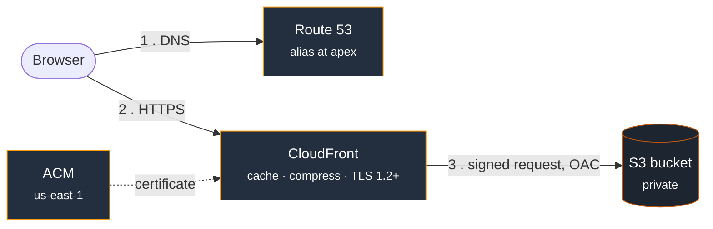

# Terraform AWS Site

This is a static site served from a private S3 bucket through CloudFront, with a real domain and certificate. The bucket, the distribution, the DNS zone, the ACM cert and its validation records are all defined in Terraform.

Live at [haseebsibtain.com](https://haseebsibtain.com).





The bucket has no route in from the internet. CloudFront is the only thing that can read it.

## Check it yourself

```bash
$ curl -sI https://haseebsibtain.com | head -1
HTTP/2 200

$ curl -sI https://hsg-resume-site-origin.s3.amazonaws.com/index.html | head -1
HTTP/1.1 403 Forbidden
```

The second one hits the bucket directly. It gets refused.

## Some important notes

**No S3 website hosting.** That endpoint only does HTTP and can't be locked to a distribution, so using it means a public bucket. Going through the REST endpoint with OAC keeps things private, and CloudFront covers what the website endpoint would have done: serving index.html at the root, and pointing 403s back at the index.

**The bucket policy names one distribution.** Trusting the CloudFront service alone would let anyone's distribution, in any AWS account, read this bucket. The SourceArn condition narrows it to mine.

**Query strings don't affect caching.** A bucket can't change its response based on a query string, so caching a separate copy per variant wastes cache and lets anyone bypass it by adding junk to the URL.

**State lives in S3** with the built-in lockfile, no DynamoDB table needed. The state bucket is made by hand, once. A backend can't create the bucket it stores its own state in.

## Layout

```
aws-s3-cloudfront/
├── versions.tf     providers, backend, us-east-1 alias for ACM
├── variables.tf
├── main.tf         bucket, OAC, distribution, content
├── dns.tf          zone, certificate, validation, alias records
├── outputs.tf
└── site/           what gets served
```

## Running it

```bash
aws s3 mb s3://<your-state-bucket>     # once, by hand
cd aws-s3-cloudfront
terraform init
terraform plan
terraform apply
```

Note: On a new domain, DNS takes two passes. Apply the zone first, put the four nameservers it gives you at your registrar, wait for that to propagate, then apply the rest. ACM validation will sit and wait until the zone is live.

To ship a content change, apply and then invalidate:

```bash
aws cloudfront create-invalidation --distribution-id <id> --paths "/index.html"
```

## Planned Improvements 

- **Segregated environments.** More would mean a module with a separate directory and state file per environment. Not choosing workspaces here, since those share a code path and so share a blast radius.
- **Terraform shouldn't be uploading the content.** Fine for a small repo, but infra and content change at different rates and usually belong in different pipelines.
- **Tightening change control.** Next step is plan on pull request and apply on merge, with GitHub Actions authenticating through OIDC instead of a stored key.
